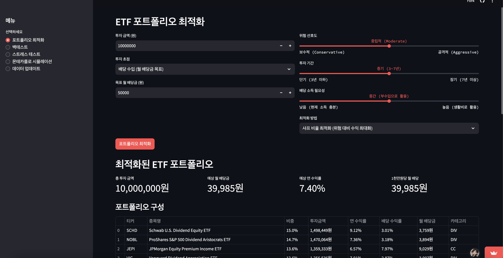

# ETF Portfolio Optimizer 사용 가이드

ETF Portfolio Optimizer는 다양한 투자 전략과 최적화 알고리즘을 사용하여 ETF 포트폴리오를 최적화하고 분석할 수 있는 웹 기반 애플리케이션입니다. 
README 파일과 requirements.txt 파일이 생성되었습니다.

## 샘플 애플리케이션 실행 결과


## 샘플 애플리케이션 웹 주소
https://etfwise.streamlit.app/

## 시작하기

1. **코드 다운로드**: 
   - 모든 Python 코드를 `app.py` 파일로 저장합니다.
   - README.md와 requirements.txt 파일을 같은 디렉토리에 저장합니다.

2. **의존성 설치**:
   ```bash
   pip install -r requirements.txt
   ```

3. **애플리케이션 실행**:
   ```bash
   streamlit run app.py
   ```

4. **웹 브라우저에서 접속**:
   - 일반적으로 http://localhost:8501에서 애플리케이션에 접속할 수 있습니다.

## 애플리케이션 기능

1. **포트폴리오 최적화**:
   - 투자 금액, 투자 초점(배당/성장/균형), 목표 수익률 또는 배당률 설정
   - 위험 선호도, 투자 기간, 소득 필요성 등의 투자자 프로필 설정
   - 다양한 최적화 방법 중 선택 (샤프 비율, 위험 패리티, 최소 분산, 목표 수익률)

2. **백테스트**:
   - 생성된 포트폴리오의 과거 성과 시뮬레이션
   - 연화 수익률, 변동성, 최대 낙폭, 샤프 비율 등의 지표 확인

3. **스트레스 테스트**:
   - 다양한 시장 시나리오에서 포트폴리오 성능 테스트
   - 베어마켓, 인플레이션, 기술주 급락, 금리 인하 등의 시나리오

4. **몬테카를로 시뮬레이션**:
   - 장기 투자 성과 예측 및 확률 분포 분석
   - 다양한 백분위수 기반 예상 가치 제공

## 기술 구현

- **ETF 데이터 관리**: Yahoo Finance API를 통한 데이터 수집 또는 모의 데이터 생성
- **최적화 알고리즘**: 샤프 비율, 위험 패리티, 최소 분산, 목표 수익률/배당 최적화
- **시뮬레이션 방법론**: 기하 브라운 운동 모델 기반 일일 수익률 시뮬레이션
- **사용자 인터페이스**: Streamlit 기반 인터랙티브 웹 인터페이스

## 주의사항

- 이 애플리케이션은 교육 및 연구 목적으로만 사용됩니다.
- 투자 결정 시 항상 자격을 갖춘 금융 어드바이저와 상담하시기 바랍니다.
- 모든 시뮬레이션과 예측은 과거 데이터와 가정에 기반하며, 미래 성과를 보장하지 않습니다.

이제 ETF Portfolio Optimizer를 설치하고 사용하여 다양한 투자 전략을 테스트하고 최적의 포트폴리오를 구성할 수 있습니다. 
